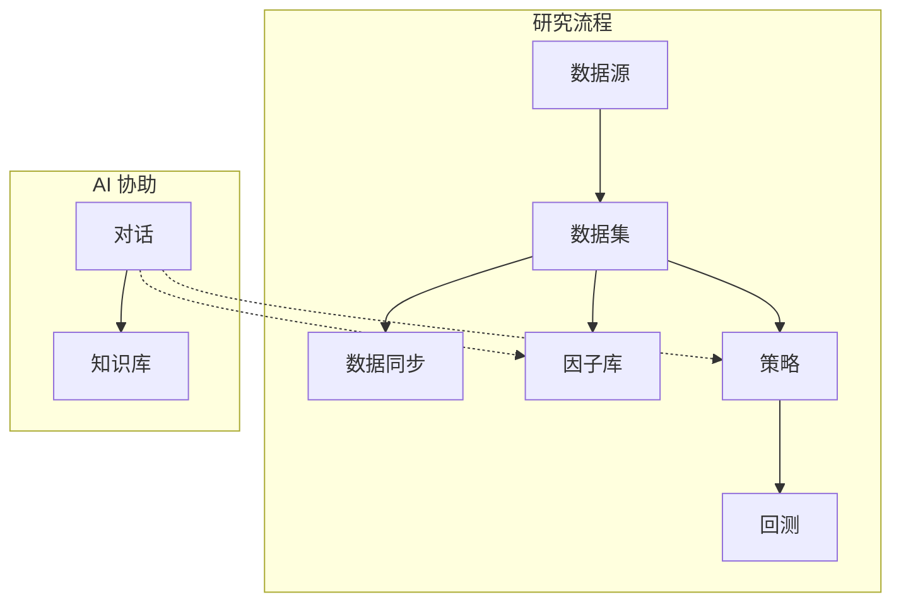

# quant-agent

## 目录

- [项目简介](#项目简介)
- [快速上手](#快速上手)
  - [源码启动](#源码启动)
    - [安装依赖](#1-安装依赖)
    - [启动服务](#2-启动服务)
    - [打开应用](#3-打开应用)
    - [使用提示](#使用提示)
  - [Docker](#docker)
  - [插件（内置与第三方）](#插件内置与第三方)
- [核心功能](#核心功能)
  - [对话](#对话)
  - [数据](#数据)
  - [研究与回测](#研究与回测)
  - [知识库](#知识库)
  - [工作流与扩展](#工作流与扩展)
  - [管理](#管理)
  - [典型研究流程](#典型研究流程)
  - [AI 协作](#ai-协作)
- [环境变量](#环境变量)

---

## 项目简介

**quant-agent** 是本地运行的量化研究与 AI 助手平台。通过 Web 界面管理行情数据、因子、策略、回测与知识库，并在对话中与多个专业子代理协作完成研究任务。

| 项目     | 说明                                                                                                           |
| -------- | -------------------------------------------------------------------------------------------------------------- |
| 前端     | 本地开发 [http://localhost:3000](http://localhost:3000)；Docker [http://127.0.0.1:8000](http://127.0.0.1:8000) |
| 后端 API | 接口前缀 `/api`，如 [http://127.0.0.1:8000/api/health](http://127.0.0.1:8000/api/health)                       |
| 数据存储 | 配置、数据库、因子源码、知识库等默认保存在 `~/.quant-agent`，可用 `QUANT_AGENT_WORKSPACE` 指定其他路径         |
| 环境要求 | Node.js 20+、pnpm 9、Python 3.11+、[uv](https://docs.astral.sh/uv/)                                            |

---

## 快速上手

### 源码启动

在本地安装 Node.js、pnpm、Python 与 [uv](https://docs.astral.sh/uv/) 后，从仓库源码运行（环境要求见 [项目简介](#项目简介)）。

#### 1. 安装依赖

在仓库根目录执行其一：

```bash
pnpm run install:all
```

或使用安装脚本（会自动检查 Node / pnpm / uv）：

```bash
# Windows
powershell -NoProfile -ExecutionPolicy Bypass -File scripts/setup.ps1

# macOS / Linux
./scripts/setup.sh
```

#### 2. 启动服务

同时启动 API 与 Web（推荐）：

```bash
pnpm dev
```

分别启动：

```bash
pnpm run dev:api   # 仅后端，端口 8000
pnpm run dev:web   # 仅前端，端口 3000
```

本地开发使用 `uvicorn app.main:app`；生产/打包启动 API 使用 `python -m app.main`。

#### 3. 打开应用

浏览器访问 [http://localhost:3000](http://localhost:3000)。若页面无法加载数据，请确认后端 API 已正常启动（`/api`）。

#### 使用提示

- **数据源**：Tushare、BaoStock 等插件需在「配置」页或数据源向导中填写 token/账号；未配置时无法拉取对应行情。
- **本地构建**：`pnpm run build`（仅前端）/ `pnpm run build:all`（前端 + API 校验）/ `pnpm run build:standalone`（便携目录）。

### Docker

无需在本机安装 Node / Python 时，可先在仓库根目录构建镜像，再用 [`docker-compose.yml`](docker-compose.yml) 启动：

```bash
pnpm run build:standalone
docker build -t quant-agent:latest .
docker compose up -d
```

仅启动（已完成镜像构建时）：

```bash
docker compose up -d
```

浏览器访问 [http://127.0.0.1:8000](http://127.0.0.1:8000)（页面在 `/`，接口在 `/api`）。`NEXT_PUBLIC_QUANT_AGENT_API` 在 `docker-compose.yml` 中配置，默认同源 `/api`。数据持久化在 Docker volume `quant-agent-data`（容器内 `/data`）。

### 插件（内置与第三方）

核心通过 `quant-agent.plugins` 入口点加载插件。插件 `pyproject.toml` 需声明 `[project.entry-points."quant-agent.plugins"]`。

| 场景                 | 内置插件来源                                                                                                        |
| -------------------- | ------------------------------------------------------------------------------------------------------------------- |
| 本地开发             | `uv sync` 安装到 `.venv`                                                                                            |
| 便携版 / Docker      | [便携版构建](#便携版) 将 `plugins/*` 以源码形式放入 `plugins/src/`，并由 `plugins/site-packages/*.pth` 加入导入路径 |
| 额外第三方（非开发） | `~/.quant-agent/plugins/site-packages`，便携版/Docker 经 `PYTHONPATH` 加载                                          |

安装第三方 wheel 示例（安装后需重启进程）：

```powershell
$plugins = "$env:USERPROFILE\.quant-agent\plugins\site-packages"
uv pip install --target $plugins .\my-plugin-0.1.0-py3-none-any.whl
```

---

## 核心功能

功能与顶栏导航一致；使用前请确保后端 API 已正常运行。

### 对话

多会话 AI 对话，支持流式回复、工具调用与授权确认，可新建、重命名、归档会话。主对话可将任务拆解并委派子代理（见 [AI 协作](#ai-协作)）；相关会话可在「会话管理」中批量归档或删除。

### 数据

- **数据源**：新增、编辑、删除插件化数据源（Tushare、BaoStock、CSV、SQL 等），测试连接，配置字段与写入规则
- **数据集**：绑定一个或多个数据源，配置预处理工作流，预览数据
- **数据同步**：配置源与目标、日期范围、Cron 与同步工作流；保存后可手动触发，并查看执行记录

典型流程：配置数据源 → 创建数据集 → 设置同步任务拉取/更新行情。

### 研究与回测

- **因子库**：管理因子元信息（分组、窗口、依赖、参数）与 Python 源码
- **策略**：查看策略列表，在工作流画布中新建、编辑、删除策略图
- **回测**：选择策略与数据集发起回测，查看绩效曲线、成交明细与运行状态

### 知识库

上传文档（txt、md、csv、json、pdf、docx、html 等），查看索引状态；右侧面板可按关键词检索命中片段。

### 工作流与扩展

**节点**：浏览内置与用户自定义工作流节点，支持预览、编辑源码、新建节点。节点用于策略、数据同步、数据集预处理等工作流编辑。

### 管理

- **会话管理**：未归档/已归档会话的批量归档、恢复、永久删除
- **任务**：查看调度作业（数据同步、知识库索引、回测等），刷新状态或取消进行中的任务
- **子代理**：为各子代理勾选可用的 Agent 工具
- **工具**：设置每个工具的授权策略（禁用 / 需授权 / 允许）
- **配置**：编辑 LLM、Embedding、Rerank、知识库检索等模块化配置并保存

### 典型研究流程



### AI 协作

主对话会根据任务自动委派子代理，例如：

- **研究**：知识库检索与证据整理
- **因子**：因子资产的查询与维护
- **策略与回测**：策略编辑、发起回测
- **数据资源**：数据源、数据集相关操作
- **节点**：工作流节点管理

可在「子代理」页限制各子代理可用工具，在「工具」页统一设置授权策略（敏感操作需你在对话中确认）。

---

## 环境变量

| 变量                          | 作用域 | 说明                                                                                               |
| ----------------------------- | ------ | -------------------------------------------------------------------------------------------------- |
| `NEXT_PUBLIC_QUANT_AGENT_API` | 前端   | API 基址，本地开发默认 `http://127.0.0.1:8000/api`；Docker 默认同源 `/api`，勿以 `/` 结尾          |
| `QUANT_AGENT_WORKSPACE`       | 后端   | 数据根目录，默认 `~/.quant-agent`                                                                  |
| `PYTHONPATH`                  | 后端   | 插件 `site-packages`（含 `.pth`）；便携版/Docker 由启动脚本或镜像设置；开发模式仅用 `.venv` 内插件 |
| `CORS_ORIGINS`                | 后端   | 允许跨域的来源，逗号分隔，默认 `*`                                                                 |

完整说明见 [`.env.example`](.env.example)。
